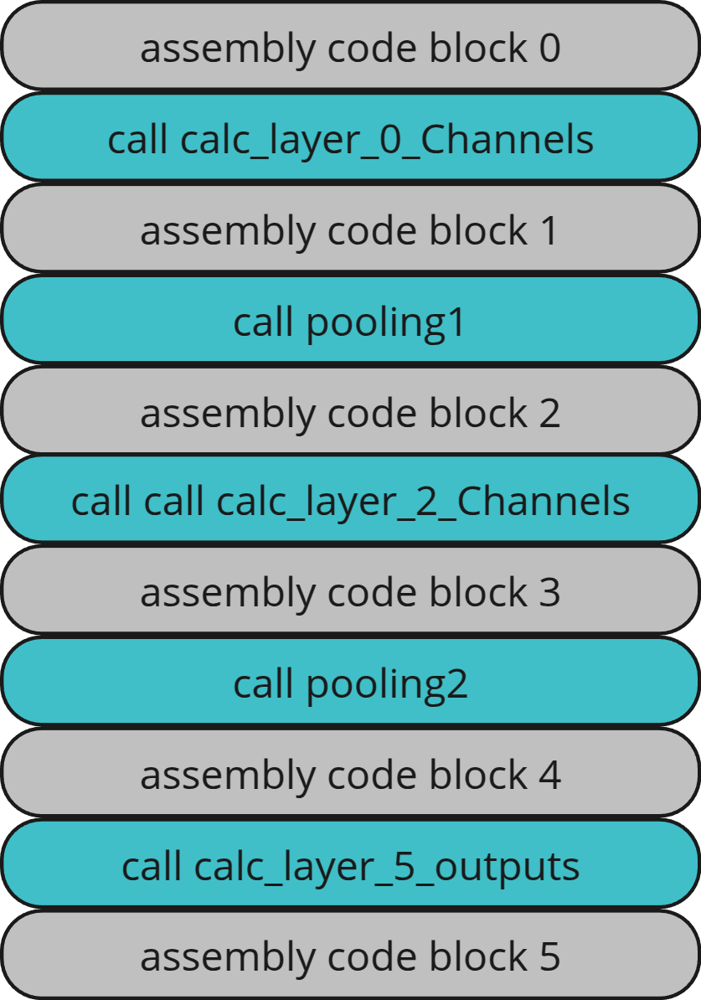
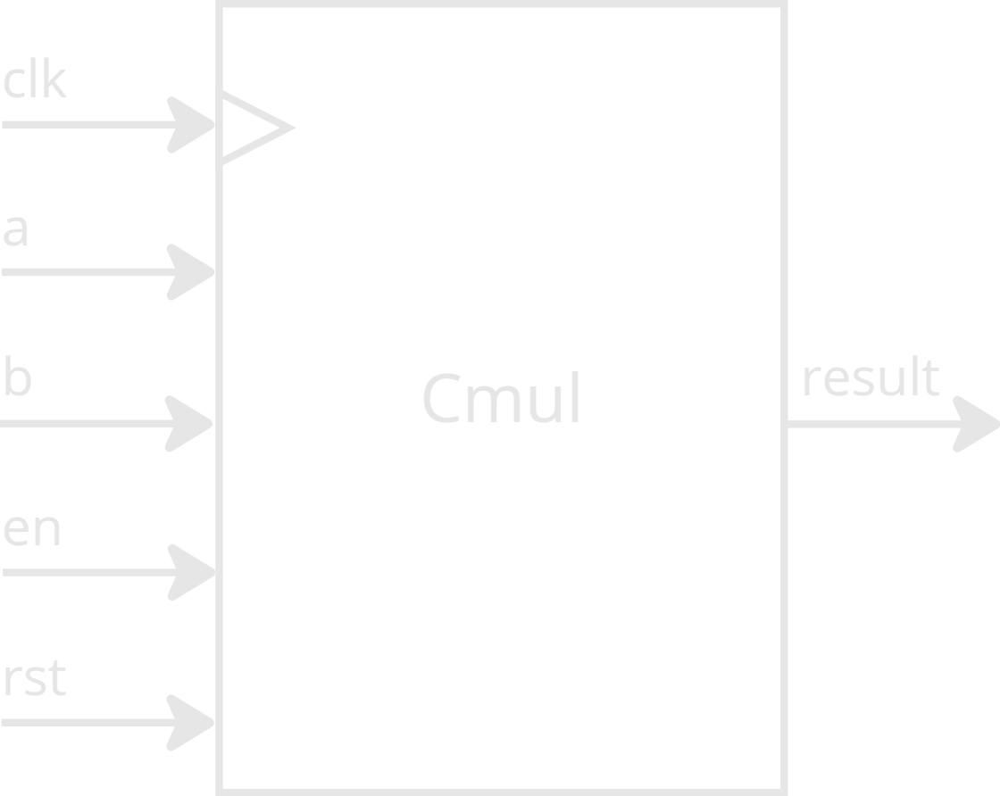
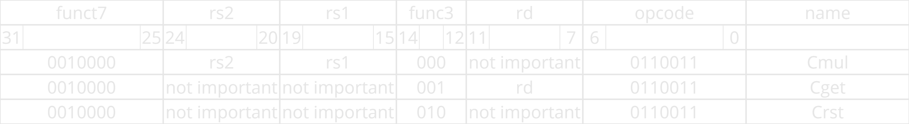
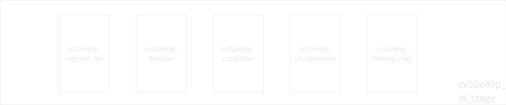
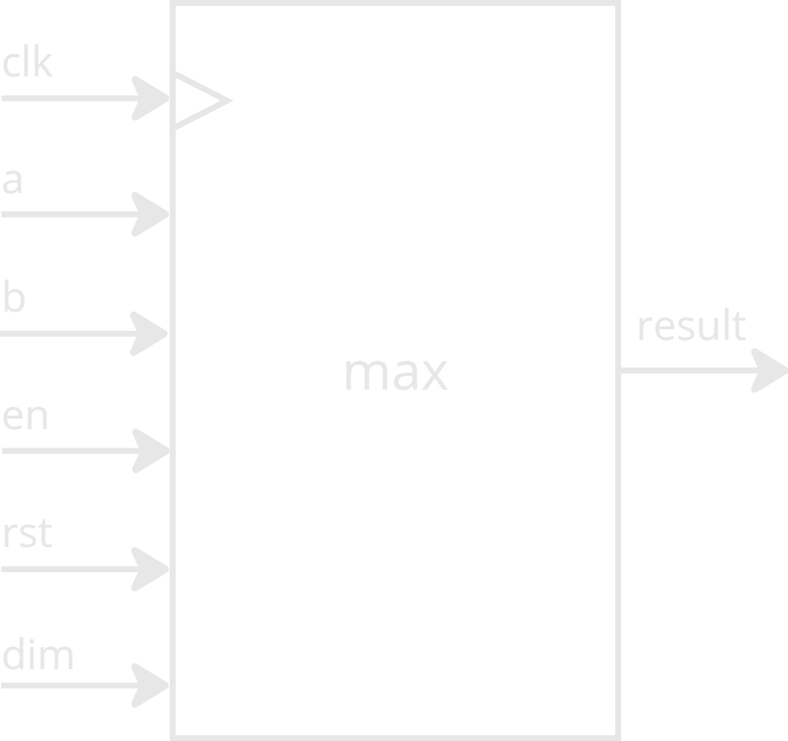

# CNN
## Content
[Abstract](#Abstract)<br>
[CNN structure](#CNN-structure)<br>
[CNN in detail](#CNN-in-detail)<br>
[The code overview](#The-code-overview)<br>
[Following assembly code](#Following-assembly-code)<br>
[How many instructions?](#How-many-instructions)<br>
[Defining the hardware accelerator and the custom instructions](#Defining-the-hardware-accelerator-and-the-custom-instructions)<br>
&nbsp;&nbsp;&nbsp;&nbsp;[Codes for custom instructions](#Codes-for-custom-instructions)<br>
[Preparing the cv32e40p core for the accelerator](#Preparing-the-cv32e40p-core-for-the-accelerator)<br>
&nbsp;&nbsp;&nbsp;&nbsp;[Decoder](#Decoder)<br>
&nbsp;&nbsp;&nbsp;&nbsp;[Id_stage](#Id-stage)<br>
&nbsp;&nbsp;&nbsp;&nbsp;[Core](#Core)<br>
&nbsp;&nbsp;&nbsp;&nbsp;[Cumulative accelerator](#Cumulative-accelerator)<br>
&nbsp;&nbsp;&nbsp;&nbsp;[Ex stage](#Ex-stage)<br>
[Configuring GCC to recognize new instructions](#Configuring-GCC-to-recognize-new-instructions)<br>
[Writing the code with the custom instructions](#Writing-the-code-with-the-custom-instructions)<br>
[What else could be accelerated?](#What-else-could-be-accelerated)
&nbsp;&nbsp;&nbsp;&nbsp;[Pooling](#Pooling)
[Testing acceleration](#Testing-acceleration)<br>
[Debugging and Problems](#Debugging-and-Problems)<br>
&nbsp;&nbsp;&nbsp;&nbsp;[Debugging tools in pulpissimo platform](#Debugging-tools-in-pulpissimo-platform)<br> 


## Abstract
The idea of this project is to train a simple convolutional neural network (CNN) in python that detects numbers from 0 to 9 in 28x28 8-bit grayscale images.
Then, to extract biases and weights.
Then to put those weights and biases in C code and compile it in gcc compiler for the Pulpissimo architecture with cv32e40p RISCY core.
Finally, to determine which instructions are repeated the most in assembly code and to create a simple hardware accelerator, anlong with custom instructions in the RISCY core that will reduce number of instructions and execution time of program.

## CNN structure
This CNN is basically the same as shown in this [YouTube](https://www.youtube.com/watch?v=jDe5BAsT2-Y&t=607s) tutorial:

The main structure of the CNN in Python terms is:

model = models.Sequential([ <br>
&emsp;&emsp;layers.Conv2D(2, (5, 5), activation='relu', input_shape=(28, 28, 1)), <br>
&emsp;&emsp;layers.MaxPooling2D(pool_size=(2, 2)), <br>
&emsp;&emsp;layers.Conv2D(4, (3, 3), activation='sigmoid'), <br>
&emsp;&emsp;layers.MaxPooling2D(pool_size=(2, 2)), <br>
&emsp;&emsp;layers.Flatten(), <br>
&emsp;&emsp;layers.Dense(10, activation='softmax') <br>
])<br>

And it has an accuracy of 96%.

## CNN in detail

It consists of 5 layers:
<div align="center">
  
</div>

The zeroth layer performs convolution with two kernels (a fancy word for a matrix of weights) of size 5x5.
The first kernel (Kernel 1) is aligned with the top-left corner of the input layer (image) and performs multiplication with the overlapped image pixels.
The multiplication is scalar (and not matrix!).
That results in a 5x5 matrix.
Then, all values in the resulting matrix are summed up, and the bias is added to the total.
Then, that sum goes through the ReLU function, y = relu(x), which is:<br>
if(x > 0) ? x : 0;<br>
The output of the ReLU function represents the top-left value (1.1) in the Activation 1 matrix, which is the output of Layer 0.
Next, Kernel 1 is moved by one pixel to the left (stride = 1), and the cycle continues, resulting in the next value (1.2) in the Activation 1 matrix.
When Kernel 1 is done with the first row of pixels, it goes back to the left and moves down by 1 row.
When Kernel 1 is done with all pixels in the image, the process is repeated with Kernel 2, creating the Activation 2 matrix, which is also the output of Layer 0.

<div align="center">
  
</div>

In layer 1 (pooling layer) both activation matrices are srunk down by half in size.
That is performed by mooving filter (2x2) to the top left corner of activation 1 matrix.
Filter doesnt contain any weights. Unlike kernels, its empty.
But it takes overlaping values, finds the greatest, and that value is now top left falue of channel 1 (layer 1 output).
Next, the filter is mooved to the left by 2 pixels, and cycle continues.
Process is the same for channel 2, the imput is just activation 2 matrix.

<div align="center">
  
</div>

In Layer 2, the same convolution process is performed as in Layer 0.
However, in this case, there are 2 input matrices: Channel 1 and Channel 2, and there are 4 kernels with dimensions (3x3x2).
In other words, each kernel has one filter (3x3) for Channel 1 and one filter (3x3) for Channel 2.
Convolution is performed on Channel 1 with Kernel 1's filter for Channel 1 (Filter 1.1) and on Channel 2 with Kernel 1's filter for Channel 2 (Filter 1.2), by overlapping kernels in the top-left positions, as in Layer 0, but no biases are added yet.
Then, the results of the convolution are 2 matrices with dimensions 3x3.
Values from those matrices are summed up, and then the bias is added to that sum.
But this time, instead of the ReLU function, the sigmoid function is used to map output values to values between 0 and 1.
The final sum represents the top-left value (1.1) in the Activation 1 matrix (10x10), which is the output of Layer 2.
Then, Kernel 1's filter for Channel 1 (Filter 1.1) moves one value to the left, as does Kernel 1's filter for Channel 2 (Filter 1.2), and the process continues.

The same is done for Kernels 2, 3, and 4, and the final output of Layer 2 consists of Activation matrices 1, 2, 3, and 4.
<div align="center">
  
</div>

In Layer 3, pooling is again performed to reduce the size of the matrices.
Pooling is done in the same way as in Layer 1, but this time it is performed on 4 matrices.

<div align="center">
  
</div>
In Layer 4, all matrix values are flattened into one array.

<div align="center">
  
</div>

In the final Layer 5, the output array of Layer 4 is connected in a neural network, and the output of Layer 5 consists of 10 percentages that represent how confident the CNN is in identifying the number it sees.

## The code overview
In the sw folder, there are three main files:<br>
cnn.py<br>
cnn.c<br>
cnn.h<br>
The Python code (cnn.py) creates a CNN model, trains it on the MNIST dataset, converts MNIST images to .pgm format, and generates weights and biases. These weights, biases, and images are saved in different formats.<br>
There are two formats for storing data:<br>
Human-readable format: Data is stored in .txt files, intended for human inspection.<br>
Machine-readable format: Data is stored in .csv files, intended for machine processing.<br>
Both formats support floating-point and fixed-point data.<br>

The C code (cnn.c) takes the generated weights, biases, and a .pgm image as input, performs CNN operations, and detects the number shown in the given image.<br> 
For this detection, the C code uses functions defined in the cnn.h file.<br>
At the top of the cnn.h file, there are comments describing how to switch between fixed-point and floating-point arithmetic.<br>
The next step is to analyze which instructions are repeated most frequently and create a hardware accelerator for them, turning them into custom instructions.
<br>
To achieve this, the .c and .h code will be converted into RISC-V assembly code. The RISC-V assembly code is chosen because the goal is to run it on the pulpissimo platform. The same GCC compiler provided by pulpissimo is used for this purpose (see the setup guide [here](https://github.com/pznikola/pulpissimo/blob/master/SETUP.md)).<br>
Storing weights, biases, and images in Python as .txt or .csv files and then reading them in C works well when running the C code on a PC. However, this approach is less suitable for microcontrollers, as some libraries (e.g., dirent.h) are not available for RISC-V compilers.<br>
While it is possible to transfer the data to the microcontroller via UART, a more elegant solution is to embed the data directly into another .h file and include it in the C code. This is why the Python script also generates a values.h file.<br>
For now, values.h is only available in fixed-point format, but it can easily be modified to support floating-point data if needed.

## Following assembly code

At first glance, the assembly code consists of 4020 lines of klingon. However, a significant portion of the assembly code is not the main focus of this project. A good starting point is the calculate function.

### Calculate function

The good news is that the code to be understood is now reduced to 124 lines of the calculate function + the functions called from within calculate.
The calculate function looks something like this:

<div align="center">
  
</div>

To make it easier to follow the assembly code, it’s often helpful to compare it to the equivalent C code. The entire calculate function in C looks like this:
```c
    //------SETUP------
    int32_t L0C  [L0_NUMBER_OF_KERNELS][L0_CHANNEL_WITH][L0_CHANNEL_WITH];  // Layer0 channels
    int32_t L0CP [L0_NUMBER_OF_KERNELS][L1_CHANNEL_WITH][L1_CHANNEL_WITH];  // Layer0 pooled channels
    int32_t L2C  [L2_NUMBER_OF_KERNELS][L2_CHANNEL_WITH][L2_CHANNEL_WITH];  // Layer2 channels
    int32_t L2CP [L2_NUMBER_OF_KERNELS][L3_CHANNEL_WITH][L3_CHANNEL_WITH];  // Layer2 pooled channels
    //------CALCULATION------
    calc_layer_0_Channels(L0C, IMG, L0K, L0B);
    pooling1(L0CP, L0C, L1_POOL_DIMENSIONS);
    calc_layer_2_Channels(L2C, L0CP, L2K, L2B);
    pooling2(L2CP, L2C, L3_POOL_DIMENSIONS);
    calc_layer_5_outputs(OUT, L2CP, L5W, L5B);
```   
Thus, assembly block 0 corresponds to this part of the C code:
```c
    int32_t L0C  [L0_NUMBER_OF_KERNELS][L0_CHANNEL_WITH][L0_CHANNEL_WITH];  // Layer0 channels
    int32_t L0CP [L0_NUMBER_OF_KERNELS][L1_CHANNEL_WITH][L1_CHANNEL_WITH];  // Layer0 pooled channels
    int32_t L2C  [L2_NUMBER_OF_KERNELS][L2_CHANNEL_WITH][L2_CHANNEL_WITH];  // Layer2 channels
    int32_t L2CP [L2_NUMBER_OF_KERNELS][L3_CHANNEL_WITH][L3_CHANNEL_WITH];  // Layer2 pooled channels
```
However, the assembly code does more than just allocate memory on the stack for these matrices. It also sets up the values for pointers that will be passed as inputs to the calc_layer_0_Channels function when it is called.

Assembly blocks 1, 2, 3, and 4 do the same thing: they set up the values for pointers that will be passed as inputs to the next functions.
Afther the last function is called, comes assembly block 5.
Assemlby block 5 ensures that the stack is cleaned up and returned to its original state, saved registers are restored, control is returned to the caller, the function’s size is marked for the linker, and the assembler is directed to the read-only data section for any subsequent data.

There is nothing to optimise here, so the next step is to dive deeper into functions:<br>
calc_layer_0_Channels<br>
pooling1<br>
calc_layer_2_Channels<br>
pooling2<br>
calc_layer_5_outputs<br>

## calc_layer_0_Channels function<br>

This function performs layer 0 convolution with image and two kernels the same way as described earlier and as shown in referenced youtube video.

main assembly code:
```assembly
calc_layer_0_Channels:
	addi	sp,sp,-64      # Allocate 64 bytes on the stack for local variables
	sw	ra,60(sp)      # Save the return address (ra) on the stack
	sw	s0,56(sp)      # Save register s0 on the stack
	sw	s1,52(sp)      # Save register s1 on the stack
	addi	s0,sp,64       # Set s0 to the top of the stack (s0 = sp + 64)
	sw	a0,-52(s0)     # Save argument a0 (L0C) on the stack
	sw	a1,-56(s0)     # Save argument a1 (IMG) on the stack
	sw	a2,-60(s0)     # Save argument a2 (L0K) on the stack
	sw	a3,-64(s0)     # Save argument a3 (L0B) on the stack
	sw	zero,-20(s0)   # Initialize temp = 0 on the stack
	sw	zero,-24(s0)   # Initialize loop counter (i = 0) on the stack
	j	.L93           # Jump to the start of the loop
```
c code:
```c
    void calc_layer_0_Channels (int32_t L0C [L0_NUMBER_OF_KERNELS][L0_CHANNEL_WITH][L0_CHANNEL_WITH],
    uint8_t IMG [IMG_HEIGHT][IMG_WIDTH],
    int32_t L0K [L0_NUMBER_OF_KERNELS][L0_KERNEL_DIMENSIONS][L0_KERNEL_DIMENSIONS],
    int32_t L0B [L0_NUMBER_OF_KERNELS])
    {
        int32_t temp = 0;
        for (int i = 0; i < L0_NUMBER_OF_KERNELS; i++) {
            for (int j = 0; j < L0_CHANNEL_WITH; j++) {
                for (int k = 0; k < L0_CHANNEL_WITH; k++) {
                    for(int g = 0; g < L0_KERNEL_DIMENSIONS; g++) {
                        for(int u = 0; u < L0_KERNEL_DIMENSIONS; u++)
                        {
                            temp = temp + mul(IMG[g+j][u+k] << DECIMAL_BITS, L0K[i][g][u]);               //FIXED POINT
                            //temp = temp + IMG[g+j][u+k] * L0K[i][g][u];                                 //FLOATING POINT
                        }
                    }
                    L0C[i][j][k] = ReLu(temp + L0B[i]);
                    temp = 0;
                }
            }
        }
    }
```
For now assembly code initialized input values, and initialised temp and i variables to  0, and in next step it jumps to first for loop at .L93
<br>
.L93 assembly code:
```assembly
.L93:
	lw	a4,-24(s0)     # Load the value of the loop counter (i) into a4
	li	a5,1           # Set a5 to 1 (loop boundary)
	ble	a4,a5,.L102    # If i <= 1, jump to .L102
	nop                    # No operation (pause)
	nop                    # No operation (pause)
	lw	ra,60(sp)      # Load the return address (ra) from the stack
	lw	s0,56(sp)      # Load register s0 from the stack
	lw	s1,52(sp)      # Load register s1 from the stack
	addi	sp,sp,64       # Free 64 bytes from the stack
	jr	ra             # Return from the function
```
This code sets the boundaries for the i loop and ensures the correct return from the calc_layer_0_Channels function. The loop will execute twice since the initial value of i is 0, and it will jump to .L102 as long as i ≤ 1.<br>
.L102 assembly code:
```assembly
.L102:
	sw	zero,-28(s0)      # Initialize loop counter (j = 0) on the stack
	j	.L94              # jump to .L94
```
This code initializes the j counter to 0 and jumps to .L94
.L94 assembly code:
```assembly
.L94:
        lw	a4,-28(s0)     # Load the value of the loop counter (j) into a4
	li	a5,23          # Set a5 to 23 (loop boundary)
	ble	a4,a5,.L101    # If j <= 23, jump to .L101
	lw	a5,-24(s0)     # Load the value of the loop counter (i) into a5
	addi	a5,a5,1        # Increment i
	sw	a5,-24(s0)     # Store value of the loop counter (i) on the stack
```
This code sets the boundaries for the j loop and increments the i counter by 1. The loop will execute 24 times since the initial value of j is 0, and it will jump to .L101 as long as j ≤ 23. There is no jr ra instruction because the assembly code for .L94 is directly above .L93, so once execution is complete, it will automatically return to .L93.
.L101 assembly code:
```assembly
.L101:
	sw	zero,-32(s0)      # Initialize loop counter k = 0) on the stack
	j	.L95              # jump to .L95
```
This code initializes the k counter to 0 and jumps to .L95<br>
.L95 assembly code:
```assembly
.L95:
	lw	a4,-32(s0)     # Load the value of the loop counter (k) into a4
	li	a5,23          # Set a5 to 23 (loop boundary)
	ble	a4,a5,.L100    # If k <= 23, jump to .L100
	lw	a5,-28(s0)     # Load the value of the loop counter (j) into a5
	addi	a5,a5,1        # Increment j
	sw	a5,-28(s0)     # Store value of the loop counter (j) on the stack
```
his code handles the k loop in the same way that .L94 handles the j loop. Additionally, it is located directly above .L94.<br>
.L100 assembly code:
```assembly
.L100:
	sw	zero,-36(s0)      # Initialize loop counter g = 0) on the stack
	j	.L96              # jump to .L96
```
This code initializes the g counter to 0 and jumps to .L96<br>
.L96 assembly code:
```assembly
.L96:

  #CALCULATING ADDRESS OF LOB[i]
	lw	a4,-36(s0)     # Load the value of the loop counter (g) into a4
	li	a5,4           # Set a5 to 4 (loop boundary)
	ble	a4,a5,.L99     # If k <= 4, jump to .L99
	lw	a5,-24(s0)     # Load the value of the loop counter (k) into a5
	slli	a5,a5,2        # Multiply k by 4 (shift left by 2 bits)
	lw	a4,-64(s0)     # Load the base address of L0B into a4
	add	a5,a4,a5       # Add offset (a5) to base address in a4, effectively getting address for LOB[i]

  #a3 = tmp + LOB[i]
	lw	a4,0(a5)       # Load value of LOB[i] into a4
	lw	a5,-20(s0)     # Load variable temp into a5
	add	a3,a4,a5       # Add temp and LOB[i] and store in a3

  #CALCULATING ADDRESS OF LOC[i][j][k] PART 1/2
	lw	a4,-24(s0)     # Load the value of k into a4
	mv	a5,a4          # Copy k to a5
	slli	a5,a5,3        # Multiply k by 8 (shift left by 3 bits)
	add	a5,a5,a4       # Add k to a5 (a5 = k * 8 + k = k*9)
	slli	a5,a5,8        # Multiply a5 by 256 (shift left by 8 bits) (a5 = k*9*256)
	mv	a4,a5          # Copy a5 to a4
	lw	a5,-52(s0)     # Load the base address of L0C into a5
	add	s1,a5,a4       # Add the base address of LOC to a5 = k*9*256 and store in s1

  #CALLING RELU
	mv	a0,a3          # Move temp (a3) to a0 (argument for ReLu)
	call	ReLu           # Call relu function
	mv	a3,a0          # Move the result of ReLu back to a3

  #CALCULATING ADDRESS OF LOC[i][j][k] PART 2/2
	lw	a4,-28(s0)     # Load the value of j into a4
	mv	a5,a4          # Copy j to a5
	slli	a5,a5,1        # Multiply j by 2 (shift left by 1 bit) and store in a5
	add	a5,a5,a4       # Add j to a5 (a5 = j * 2 + j = j*3)
	slli	a5,a5,3        # Multiply a5 by 8 (shift left by 3 bits) (a5 = j*3*8 = j*24)
	lw	a4,-32(s0)     # Load the value of k into a4
	add	a5,a5,a4       # Add k to a5 (j*24)
	slli	a5,a5,2        # Multiply a5 by 4 (shift left by 2 bits) (a5 = (j*24 + k)*4)
	add	a5,s1,a5       # Add s1 (base address of LOC + k*9*256) to a5 ((j*24 + k)*4), getting final adress of L0C[i][j][k] and store it in a5
	sw	a3,0(a5)       # Store the result of ReLu in L0C[i][j][k]

  #RESETING tmp AND INCREMENTNG k
	sw	zero,-20(s0)   # Reset temp to 0 and store it on the stack
	lw	a5,-32(s0)     # Load the value of k into a4
	addi	a5,a5,1        # Increment k
	sw	a5,-32(s0)     # Store value of the loop counter (k) on the stack
```

.L96 is slightly different because it has to perform the following tasks:<br>
Same tasks as other for loops:
- Set the boundaries for the g loop
- Increment the k counter
  
Additional tasks:
- Calculate the address of LOB[i]
- Sum tmp and LOB[i]
- Calculate the address of LOC[i][j][k]
- Call the ReLU function

This is a standard procedure when working with tensors, but many of these instructions could be accelerated using dedicated hardware. Additionally, the .L96 code is located directly above .L95.
However, this is still not the end of the code. Before .L96 executes any of the operations mentioned above, it first goes through the .L99 loop.<br>
.L99 assembly code:
```assembly
.L99:
	sw	zero,-40(s0)      # Initialize loop counter u = 0) on the stack
	j	.L97              # jump to .L97
```
This code initializes the u counter to 0 and jumps to .L97<br>
.L97 assembly code:
```assembly
.L97:
	lw	a4,-40(s0)      # Load the value of the loop counter (u) into a4
	li	a5,4		# Set a5 to 4 (loop boundary)
	ble	a4,a5,.L98    	# If k <= 24, jump to .L98
	lw	a5,-36(s0)	# Load the value of the loop counter (g) into a5
	addi	a5,a5,1		# Increment g
	sw	a5,-36(s0)      # Store value of the loop counter (g) on the stack
```
This code handles the u loop in the same way that .L94 handles the j loop. Additionally, it is located directly above .L96.<br>
.L98 assembly code:
```assembly
.L98:
	#CALCULATING IMG[g + j][u + k] << DECIMAL_BITS
	lw	a4,-36(s0)        # Load the value of (g) into a4
	lw	a5,-28(s0)	  # Load the value of (j) into a5
	add	a5,a4,a5	  # Calculate (g + j) and store in a5
	mv	a4,a5             # Move (g + j) to a4
	mv	a5,a4             # Move (g + j) to a5
	slli	a5,a5,3           # Multiply (g + j) by 8 (shift left by 3 bits)
	sub	a5,a5,a4          # Subtract (g + j) from a5 (a5 = (g + j) * 8 - (g + j) = (g+j)*7)
	slli	a5,a5,2           # Multiply a5 by 4 (shift left by 2 bits) a5 = 4*7*(g+j)
	mv	a4,a5             # Move the result to a4
	lw	a5,-56(s0)        # Load the base address of IMG into a5
	add	a4,a5,a4          # Calculate the address of IMG[g + j] and store in a4
	lw	a3,-40(s0)	  # Load the value of (u) into a3
	lw	a5,-32(s0)        # Load the value of (k) into a5
	add	a5,a3,a5          # Calculate (u + k) and store in a5
	add	a5,a4,a5          # Calculate the final address of IMG[g + j][u + k] and store in a5
	lbu	a5,0(a5)	  # Load the byte value of IMG[g + j][u + k] into a5 (unsigned) (because IMG is uint8_t type)
	slli	a2,a5,16	  # Shift IMG[g + j][u + k] left by 16 bits (equivalent to multiplying by 65536)(fixed point conversion)

	#CALCULATING L0K[i][g][u]
	lw	a4,-24(s0)	  # Load the value of (i) into a4
	li	a5,100	 	  # Load the constant 100 into a5
	mul	a5,a4,a5	  # Multiply (i) by 100 and store in a5 (a5 = i*100)
	lw	a4,-60(s0)	  # Load the base address of L0K into a4
	add	a3,a4,a5	  # Calculate the address of L0K[i] and store in a3 (a3 = base address of L0K + i*100)
	lw	a4,-36(s0)	  # Load the value of (g) into a4
	mv	a5,a4		  # Move (g) to a5
	slli	a5,a5,2		  # Multiply (g) by 4 (shift left by 2 bits) (a5 = g*4)
	add	a5,a5,a4	  # Add (g) to a5 (a5 = g * 4 + g = g*5)
	lw	a4,-40(s0)	  # Load the value of (u) into a4
	add	a5,a5,a4	  # Add (u) to a5 (a5 = g*5 + u)
	slli	a5,a5,2           # Multiply a5 by 4 (shift left by 2 bits) (a5 = (g*5 + u)*4)
	add	a5,a3,a5	  # Calculate the final address of L0K[i][g][u] and store in a5
	lw	a5,0(a5)	  # Load the value of L0K[i][g][u] into a5

	#CALLING mul
	mv	a1,a5		  # Move L0K[i][g][u] to a1 (second argument for mul)
	mv	a0,a2		  # Move IMG[g + j][u + k] << 16 to a0 (first argument for mul)
	call	mul		  # Call the mul function
	mv	a4,a0		  # Move the result of mul to a4

	#UPDATING tmp AND INCREMENTING u
	lw	a5,-20(s0)	  # Load the value of temp into a5
	add	a5,a5,a4	  # Add the result of mul to temp
	sw	a5,-20(s0)	  # Store the updated value of temp
	lw	a5,-40(s0)	  # Load the value of (u) into a5
	addi	a5,a5,1		  # Increment (u) by 1
	sw	a5,-40(s0)	  # Store the updated value of (u)
```
As before, most of the code is responsible for calculating the addresses of L0K[i][g][u] and IMG[g + j][u + k]. Additionally, this code is located directly above .L97.<br>
The only remaining step is to go through the mul function.<br>
.mul assembly code:
```assembly
mul:
	addi	sp,sp,-32	# Allocate 32 bytes on the stack for local variables
	sw	s0,28(sp)	# Save the s0 register on the stack
	addi	s0,sp,32	# Set s0 to the top of the stack (s0 = sp + 32)
	sw	a0,-20(s0)	# Save the first argument (a) on the stack
	sw	a1,-24(s0)	# Save the second argument (b) on the stack
	lw	a1,-20(s0)	# Load the first argument (a) into a1
	mv	a6,a1		# Move first argument (a) to a6
	srai	a1,a1,31	# Sign-extend a to 64 bits (a1 = a >> 31)
	mv	a7,a1		# Move the sign-extended upper 32 bits to a7
	lw	a1,-24(s0)	# Load the second argument (b) into a1
	mv	a2,a1		# Move b to a2
	srai	a1,a1,31	# Sign-extend b to 64 bits (a1 = b >> 31)
	mv	a3,a1		# Move the sign-extended upper 32 bits to a3
	mul	a0,a7,a2	# Multiply the upper 32 bits of a with the lower 32 bits of b (a0 = (a >> 31) * b)
	mul	a1,a3,a6	# Multiply the upper 32 bits of b with the lower 32 bits of a (a1 = (b >> 31) * a)
	add	a1,a0,a1	# Add the two intermediate results (a1 = (a >> 31) * b + (b >> 31) * a)
	mul	a0,a6,a2	# Multiply the lower 32 bits of a and b (a0 = a * b)
	mulhu	a5,a6,a2	# Multiply the lower 32 bits of a and b, store the upper 32 bits in a5 (a5 = (a * b) >> 32)
	mv	a4,a0		# Move the lower 32 bits of the result to a4
	add	a3,a1,a5	# Add the intermediate results to the upper 32 bits (a3 = (a >> 31) * b + (b >> 31) * a + (a * b) >> 32)
	mv	a5,a3		# Move the final upper 32 bits to a5
	slli	a3,a5,16	# Shift the upper 32 bits left by 16 bits (a3 = a5 << 16)
	srli	t1,a4,16	# Shift the lower 32 bits right by 16 bits (t1 = a4 >> 16)
	or	t1,a3,t1	# Combine the upper and lower parts (t1 = (a5 << 16) | (a4 >> 16))
	srai	t2,a5,16	# Sign-extend the upper 32 bits (t2 = a5 >> 16)
	mv	a5,t1		# Move the combined result to a5
	mv	a0,a5		# Move the final result to a0 (return value)
	lw	s0,28(sp)	# Restore the s0 register from the stack
	addi	sp,sp,32	# Deallocate 32 bytes from the stack
	jr	ra		# Return from the function
```
## How many instructions?
Now, this is a lot of code. Fortunately, there is no need to understand every detail, as a hardware accelerator for this computation would operate differently.<br>

However, there are 32 instructions in this section, each executing in a single cycle each.

The code that calls the mul function, .L98, takes 44 cycles on its own, so the total execution time for .L98 including mul is:<br>
32 + 44 = 76 cycles.<br>

The .L98 code runs L0_KERNEL_DIMENSIONS = 5 times, alongside .L97, which calls it.<br>
Since .L97 has 3 additional loop instructions, the total cycle count is:<br>
(32 + 44 + 3) * 5 = 395 cycles.<br>

The .L97 code is called by .L99, adding 2 more instructions, and .L99 is called by .L96, adding another 3 instructions:<br>
((32 + 44 + 3) * 5 + 2 + 3) = 400 cycles.<br>

The .L99 code is called by .L96 L0_KERNEL_DIMENSIONS = 5 times, giving:<br>
((32 + 44 + 3) * 5 + 2 + 5) * 5 = 2000 cycles.<br>

The .L96 code itself introduces 31 additional instructions + 10 relu instructions, so:<br>
((32 + 44 + 3) * 5 + 2 + 5) * 5 + 41 = 2041 cycles.<br>

The .L96 code is called by .L100, adding 2 more instructions, and .L100 is called by .L95, adding another 3:<br>
((32 + 44 + 3) * 5 + 2 + 5) * 5 + 41 + 5 = 2046 cycles.<br>

The .L100 code runs L0_CHANNEL_WIDTH = 28 times, resulting in:<br>
(((32 + 44 + 3) * 5 + 2 + 5) * 5 + 41 + 5) * 28 = 57,288 cycles.<br>

The .L95 code itself adds 3 more instructions, so:<br>
(((38 + 44 + 3) * 5 + 2 + 5) * 5 + 41 + 5) * 28 + 3 = 57,291 cycles.<br>

The .L95 code is called by .L101, adding 2 more instructions, and .L101 is called by .L94, adding another 3:<br>
(((38 + 44 + 3) * 5 + 2 + 5) * 5 + 41 + 5) * 28 + 3 + 5 = 57,296 cycles.<br>

The .L101 code runs L0_CHANNEL_WIDTH = 28 times, leading to:<br>
((((38 + 44 + 3) * 5 + 2 + 5) * 5 + 41 + 5) * 28 + 3 + 5) * 28 = 1,604,288 cycles.<br>

The .L94 code introduces 3 more instructions, so:<br>
((((38 + 44 + 3) * 5 + 2 + 5) * 5 + 41 + 5) * 28 + 3 + 5) * 28 + 3 = 1,604,291 cycles.<br>

The .L94 code is called by .L102, adding 2 more instructions, and .L102 is called by .L93, adding another 3:<br>
((((38 + 44 + 3) * 5 + 2 + 5) * 5 + 41 + 5) * 28 + 3 + 5) * 28 + 3 + 5 = 1,604,296 cycles.<br>

The .L102 code runs L0_NUMBER_OF_KERNELS = 2 times, so:<br>
(((((38 + 44 + 3) * 5 + 2 + 5) * 5 + 41 + 5) * 28 + 3 + 5) * 28 + 3 + 5) * 2 = 3,208,592 cycles.<br>

Finally, .L93 is called by calc_layer_0_Channels, which adds 12 more cycles, resulting in:<br>
≈ 3,208,592  cycles just for the first layer calculation.<br>

<div align="center">
  
</div>

The idea is to create a hardware accelerator that will perform the mul function, as well as accumulate the result, in (hopefully) less than around 4 cycles.<br>
Basically, to make this code:<br>
```c
temp = temp + mul(IMG[g+j][u+k] << DECIMAL_BITS, L0K[i][g][u]);
```
hardware accelerated.
## Defining the hardware accelerator and the custom instructions

The Hardware Accelerator should be defined as:
```verilog
input  logic 	    clk
input  logic 	    rst
input  logic 	    en
input  logic [31:0] a
input  logic [31:0] b
output logic [31:0] result
```
<br>
<div align="center">
  
</div>
<br>
And there should be at least 3 custom instructions for it:<br>
Cmul a, b<br>
This instruction brings operands a and b to the accelerator and enables it.<br>
Cget rx<br>
This instruction takes the result from the accelerator and stores it in the rx register.<br>
Crst<br>
This instruction resets the accelerator.<br>

### Codes for custom instructions

There is a lot of room for improvement and creativity here. But since this is just a foundation for my bachelor's thesis, and not a high-end company product, there is only a need for the following conditions to be met:

- The code must not overlap with any existing code for other Standard or Pulp extended instructions.
- he code should leave space for about 5 or 6 additional instructions.
- All added code should be grouped in some way (quality of life condition, optional).

An opcode that meets these conditions (among others) is 0110011, i.e. the opcode for the add instruction.
Now, funct7 should be chosen.

The first two bits of funct7 (11 and 10) are already taken by the Pulp extensions.
0000000 and 0100000 are also taken by standard RV32I ALU instructions.
01xxxxx and 000xxxx are taken by Pulp instructions. Not all the x bits are taken, and there are probably holes that could be used, but that requires additional brain power, which is already limited.
0000001 is also taken for the M extension.

Now, that leaves us with a lot of free space.
For organizational reasons and to make things simpler, this will be the funct7 space for instructions: 001xxxx.
So, 001 0000 < funct7 < 001 1111.
That is 16 funct7 codes, and every funct7 code has 3 bits for funct3, so in total, 16 * 8 = 128 instructions, which is enough to create a separate instruction set.

So, the codes for the first 3 instructions should look like this:
<br>
<div align="center">
  
</div>
<br>

## Preparing the cv32e40p core for the accelerator

From this point on, most of the work will be done in Verilog (the fun part).
All files in the cv32e40p core that are going to be changed and all files that are going to be added to the cv32e40p core, are in the directory:
/hw/rtl.<br>
Other propriatary files (that will be mentioned later in the code) needed for configuring the compiler are in the directory /hw/gcc_files.<br>
The goal is to modify the cv32e40p core of Pulpissimo to run our custom instruction on the custom hardware accelerator.
However, to modify the cv32e40p core, one must first open it.
Detailed instructions for installing pulpissimo can be found [here](https://github.com/pznikola/pulpissimo/blob/master/SETUP.md)).<br>
If this is your first time, expect to spend some time on it.
Once Pulpissimo is downloaded, the files for the cv32e40p core can be found by opening the terminal from pulpissimo/utils/bin and typing the command:

```
/bender packages --flat
```
Next, type in this command:
```
for pkg in $(./bender packages --flat); do
    ./bender clone "$pkg"
done
```
This will create a working_dir folder in the Pulpissimo folder, and all Pulpissimo RTL files will be there, in separate folders.
The cv32e40p files are located in pulpissimo/working_dir/cv32e40p/rtl.

A detailed description and datasheet of cv32e40p can be found [here](https://github.com/openhwgroup/cv32e40p)).<br> 
This is just an oversimplified version that covers only the things related to this topic.

//*TODO:
MAKE THIS SHORT OVERSIMPLIFIED VERSION A LITTLE BIT LESS OVERSIMPLIFIED*//

The Riscy core is made up of separate units and pipeline stages, following a classic fetch-decode-execute structure.

<br>
<div align="center">
  
</div>
<br>

Since there will be no changes to the core, the instruction fetch stage (if_stage) will remain unchanged.
The only changes that will be made are in the files:
```
cv32e40p_core 		    (changed)
└── cv32e40p_id_stage       (changed)
    └── cv32e40p_decoder    (changed)
└── cv32e40p_ex_stage       (changed)
    └── cv32e40p_cumulative (added)
```

This is how the instruction decode stage looks:

<br>
<div align="center">
  
</div>
<br>

/*TODO
WRITE BRIEF DESCRIPTION ON HOW id stage works*/

### Decoder
The good starting point is cv32e40p_decoder.<br>
There under:<br>
unique case (instr_rdata_i[6:0])<br>
under:<br>
OPCODE_OP<br>
under:<br>
// PREFIX 00/01<br>
else begin<br>
at the end of that else, this code should be added.

```verilog
{6'b01_0000, 3'b000}: begin         // cmul
  alu_en = 1'b0;
  cml_en = 1'b1;
  cml_rst = 1'b0;
  cml_get = 1'b0;
  regb_used_o = 1'b1;
  rega_used_o = 1'b1;
  regfile_alu_we = 1'b0;
end
{6'b01_0000, 3'b001}: begin         // cget
  alu_en = 1'b0;
  cml_en = 1'b0;
  cml_rst = 1'b0;
  cml_get = 1'b1;
  regb_used_o = 1'b0;
  rega_used_o = 1'b0;
  regfile_alu_we = 1'b1;
end
{6'b01_0000, 3'b001}: begin         // crst
  alu_en = 1'b0;
  cml_en = 1'b1;
  cml_rst = 1'b1;
  cml_get = 1'b0;
  regb_used_o = 1'b0;
  rega_used_o = 1'b0;
  regfile_alu_we = 1'b0;
end
```
This code sets input control signals for cumulative mul accelerator: enable, get, and reset. It disables ALU and defines the use of operands a and b.
There is a need for the get signal because there will be cases when cumulative multiplying shouldn't be done, but the result of our accelerator should be forwarded into the destination register.
rega_used_o and regb_used_o are signals that are useful for control and forwarding, since some instructions use three, two, one, or no operands.
regfile_alu_we is a signal that decides if the result of some instruction will be written back to the register file (write enable).
Since the result will be written to the register file only in the cget function, only there should regfile_alu_we = 1'b1.
Naturally, cml_en, cml_get, and cml_rst are new signals and should be defined in the same place and in the same way as alu_en is defined.
They can have any name, but I was not mature enough to go with the first 3 letters.
Also, at the beginning of the first always_comb, under alu_en = 1'b1, this should also be added:<br>
cml_en  = 1'b0;<br>
cml_get  = 1'b0;<br>
cml_rst = 1'b0;<br>
These are default values, so in other instructions, our accelerator is not enabled and is not reset.<br>
Since cml_en and cml_rst are new signals, they should also be outputs of cv32e40p_decoder, so in the module definition this code should be added:<br>
```verilog
// CUMULATIVE signals
output logic        cml_en_o, 
output logic        cml_rst_o,
output logic        cml_get_o,  
```
Finally, at the end of the cv32e40p_decoder module, this code should be added to connect variables with output signals.<br>

```verilog
assign cml_en_o                   = (deassert_we_i) ? 1'b0          : cml_en;
assign cml_rst_o                  = (deassert_we_i) ? 1'b0          : cml_rst;
assign cml_get_o                  = (deassert_we_i) ? 1'b0          : cml_get;
```

And that's it for the cv32e40p_decoder module.<br>
Now, since this module is integrated into cv32e40p_id_stage, and 2 more outputs of the cv32e40p_decoder were added, there should also be added this code:<br>
```verilog
.cml_en_o(cml_en),
.cml_get_o(cml_en), 
.cml_rst_o(cml_rst),
```
Where cml_en and cml_rst are new variables, that should be created by following the example of alu_en.<br>
### Id_stage
At the ID-EX pipeline in cv32e40p_id_stage, where local variables are connected to output signals this code should be added:<br>
```verilog
cml_en_ex_o <= cml_en;
cml_get_ex_o <= cml_en;  
if (cml_en) begin
   cml_operand_a_ex_o <= alu_operand_a;
   cml_operand_b_ex_o <= alu_operand_b;
   cml_rst_ex_o       <= cml_rst;
end
```
Where again, cml_operand_a_ex_o, cml_operand_b_ex_o, cuml_en_ex_o, cml_rst_ex_o are new output signals of cv32e40p_id_stage and should be created following the example of alu_en_ex_o.<br>
cml_operand_a_ex_o and cml_operand_b_ex_o are connected to alu_operand_a and alu_operand_b because it was convenient.<br>
In cv32e40p_decoder new signals could be made following the example of alu_operand_a and alu_operand_b but they would do the same job, just have a different name. So just using alu_operand_b and alu_operand_b was easier.<br>
Also at the same ID-EX pipeline under if (rst_n == 1'b0) those new output signals should all be reset to 0.<br>
Also below that code alu_en is used with other enable signals to check that instruction after taken branch is flushed and that EX stage is ready to receive flushed instruction immediately.<br>
And to check that illegal instruction has no other side effects.<br>
There should also be added cml_en following the example of alu_en.<br>
Finally there is one part of code where:<br>
```verilog
//EX stage is ready but we don't have a new instruction for it, 
//so we set all write enables to 0, but unstall the pipe
```

It could be found by searching for those comments.<br>
These lines should be added there:<br>
```verilog
cml_en_ex_o          <= 1'b0;
cml_get_ex_o          <= 1'b0;
```

And thats all of the changes for cv32e40p_id_stage.<br>
### Core
Now since cv32e40p_id_stage is integrated in cv32e40p_core, and outputs of cv32e40p_id_stage are changed, it should be updated in cv32e40p_core.<br>
New values should be connected to new local variables.<br>
Those new local variables only connect new cv32e40p_id_stage signals to cv32e40p_ex_stage.<br>
So new input signals in cv32e40p_ex_stage should be created.<br>

```verilog
input logic        [31:0] cml_operand_a_i,
input logic        [31:0] cml_operand_b_i,
input logic               cml_en_i,
input logic               cml_get_i,
input logic               cml_rst_i,
```
### Cumulative accelerator
Now is the time to start writing cumulative accelerator.
Its very simlple and short that I dont even need to put it in separate file:

```verilog
module cv32e40p_cumulative #(
  //
) (
  input  logic        clk_i,
  input  logic        rst_n_global_i,
  input  logic        rst_p_forced_i,
  input  logic        en_i,
  input  logic [31:0] a_i,
  input  logic [31:0] b_i,
  output logic [31:0] result_o
);

  logic [63:0] product;
  logic [31:0] product_shift;
  logic [31:0] result;

  assign product = a_i * b_i;
  assign product_shift = product[47:16];

  always_ff @(posedge clk_i or negedge rst_n_global_i or posedge rst_p_forced_i) begin
    if      (!rst_n_global_i || rst_p_forced_i) result <= 32'b0;
    else if (en_i)                              result <= result + product_shift;
  end
  assign result_o = result; 

endmodule  // cv32e40p_cumulative
```
Its pretty much self explanatory.
### Ex stage
integrating it into cv32e40p_ex_stage is also simple and can be done by following the example of the ALU. The output should be connected to the output of cv32e40p_ex_stage in this part of the code:

```verilog
...
    end else begin
      regfile_alu_we_fw_o    = regfile_alu_we_i & ~apu_en_i;  // private fpu incomplete?
      regfile_alu_waddr_fw_o = regfile_alu_waddr_i;
      if (alu_en_i) regfile_alu_wdata_fw_o = alu_result;
      if (cml_en_i || cml_get_i) regfile_alu_wdata_fw_o = cml_result;
      if (mult_en_i) regfile_alu_wdata_fw_o = mult_result;
      if (csr_access_i) regfile_alu_wdata_fw_o = csr_rdata_i;
    end
...
```
And thats it.
Before building the RTL code, the new accelerator module should be added to the bender.yml file in pulpissimo/working_dir/cv32e40p.
Next, open a terminal from the pulpissimo folder, and build the RTL code using the command make build.
Any potential errors in the code will be displayed there.

## Configuring GCC to recognize new instructions

In the directory riscv-gnu-toolchain/riscv-binutils/opcodes, open the file riscv-opc.c.
Under the struct struct riscv_opcode riscv_opcodes[], add the following lines:
```c
{"cmul",  	0, INSN_CLASS_I,   "s,t",  MATCH_CMUL, MASK_CMUL, match_opcode, 0 },
{"cget",  	0, INSN_CLASS_I,   "d",  MATCH_CGET, MASK_CGET, match_opcode, 0 },
{"crst",  	0, INSN_CLASS_I,   "",  MATCH_CRST, MASK_CRST, match_opcode, 0 },
```

- The first 0 indicates that the instruction is 32-bit. If it were 64-bit, it should be replaced with 64.
- INSN_CLASS_I means that the instruction belongs to the standard instruction set.
- "s,t" means that the instruction has two source registers (s = first source register, t = second source register).
- "d" means that the instruction has only one destination register.
- "" means that the instruction uses no registers at all.
- MATCH_CMUL, MASK_CMUL, MATCH_CGET, MASK_CGET, MATCH_CRST, and MASK_CRST are constants that will be defined in another file.
- match_opcode is a function that will be called to use these constants.
- The last 0 is reserved for additional advanced functions, which are not used in these instructions.

Save changes in this file.

Next in location : riscv-gnu-toolchain/riscv-binutils/include/opcode open riscv-opc.h<br>
At the top (or anywhere else) of the code, theese lines should be added

```c
#define MATCH_CMUL 0x20000033
#define MASK_CMUL 0xFE007FFF
#define MATCH_CGET 0x20001033
#define MASK_CGET 0xFFFFF07F
#define MATCH_CRST 0x20002033
#define MASK_CRST 0xFFFFFFFF
```

For every instruction, constants MATCH_<instruction_name> nad MASK_<instruction_name> should be defined.
MATCH_<instruction_name> and MASK_<instruction_name> have the same number of bits as the instruction.
MATCH_<instruction_name> is derived from instruction by putting 0 in bits that represent rs0, rs1 and rd.
MASK_<instruction_name> is derived from instruction by putting 1 in bits that represent funct7, funct3, opcode and every register that is not used.
In case of cmul, rd is not used.
In case of cget, rs0 and rs1 are not used.
In case of crst, rs0, rs1 and rd are not used.
At the end those values are just converted to hexadecimal.
Its inportant that in riscv-opc.h no unnecessary comments or spaces are added.
Save changes in this file.<br>

Open terminal in location /riscv-gnu-toolchain.<br>
Run this commands:
```
make clean
make
```
This will take some time. About 2 hours.
Make sure that in bashrc PULP_RISCV_GCC_TOOLCHAIN path is defined only once.
Otherwise, gcc might be compiled in one path, and pulpissimo will use older version of gcc from different path.
When build is done, build pulpissimo and run test program.

## Writing the code with the custom instructions
To run test program, follow the same rules in pulpissimo readme file, for running hello world program.
Just instead of the hello world program, copy content of sw/test.c into the hello world program.

Integrating cmul, cget and crst into c and making it c compatabile, will be done [here](Part of this code where its done).<br>

## What else could be accelerated?

Accelerating anything else further in this part of the code would only speed up by few percent, so lets go back to other layers.

Next layer is pooling1:

### Pooling

Same process will be repeated in accelerating pooling layer

c code:<br>

```c
void pooling1 (int32_t L0CP[L0_NUMBER_OF_KERNELS][L1_CHANNEL_WITH][L1_CHANNEL_WITH],
int32_t L0C [L0_NUMBER_OF_KERNELS][L0_CHANNEL_WITH [L0_CHANNEL_WITH], int dimension)
{
    int col;
    int row;
    for (int i = 0; i < L0_NUMBER_OF_KERNELS; i++) {
        int m;
        int j;
        for (j = 0, m = 0; j < L0_CHANNEL_WITH; j = j + dimension, m++) {
            int n;
            int k;
            for (k = 0, n = 0; k < L0_CHANNEL_WITH; k = k + dimension, n++) {
                col = k;
                row = j;
                for (int g = 0; g < dimension; g++) {
                    for (int h = 0; h < dimension; h++) {
                        if(L0C[i][j+g][k+h] > L0C[i][row][col])
                        {
                            col = k+h;
                            row = j+g;
                        }
                    }
                }
                L0CP[i][m][n] = L0C[i][row][col];
            }
        }
    }
}
```
pooling1 assembly code:<br>

```assembly
pooling1:
	addi	sp,sp,-80	# Allocate 80 bytes on the stack (for local variables and saved registers)
	sw	s0,76(sp)	# Save the value of register s0 on the stack (at offset 76 from sp)
	addi	s0,sp,80	# Set s0 to point to the end of the allocated stack frame (sp + 80)
	sw	a0,-68(s0)	# Save the value of argument a0 (pointer to L0CP) on the stack (at offset -68 from s0)
	sw	a1,-72(s0)	# Save the value of argument a1 (pointer to L0C) on the stack (at offset -72 from s0)
	sw	a2,-76(s0)	# Save the value of argument a2 (dimension) on the stack (at offset -76 from s0)
	sw	zero,-28(s0)    # Initialize a local variable on the stack (at offset -28 from s0) to 0
	j	.L104		# Jump to label .L104 (start of the main loop)
```

.L104 assembly code:

```assembly
L104:
	lw	a4,-28(s0)	# Load the value of the local variable (i) (at offset -28 from s0) into register a4
	li	a5,1		# Load the immediate value 1 (L0_NUMBER_OF_KERNELS) into register a5
	ble	a4,a5,.L114	# If i < L0_NUMBER_OF_KERNELS jump to L114
	nop
	nop
	lw	s0,76(sp)	# Restore the value of register s0 from the stack (at offset 76 from sp)
	addi	sp,sp,80	# Deallocate the stack space (move the stack pointer back by 80 bytes)
	jr	ra		# Jump to the return address (end of the function)
```

.L114 assembly code:

```assembly
L114:
	sw	zero,-36(s0)	# Sets j = 0
	sw	zero,-32(s0)	# Sets m = 0
	j	.L105		# Jumps to L105
```

.L105 assembly code:

```assembly
.L105:
	lw	a4,-36(s0)	# Load the value of j into register a4
	li	a5,23		# Load the immediate value 23 (L0_NUMBER_OF_KERNELS) into register a5
	ble	a4,a5,.L113	# If j < L0_NUMBER_OF_KERNELS jump to L113
	lw	a5,-28(s0)	# Load the value of i into register a5
	addi	a5,a5,1		# Increment i
	sw	a5,-28(s0)	# Save i
```
L105 is directly above L104.<br>

.L113 assembly code:
```assembly
.L113:
	sw	zero,-44(s0)	# Sets k = 0
	sw	zero,-40(s0)	# Sets n = 0
	j	.L106		# Jumps to L106
```

.L106 assembly code:
```assembly
.L106:
	lw	a4,-44(s0)	# Load the value of k into register a4
	li	a5,23		# Load the immediate value 23 (L0_NUMBER_OF_KERNELS) into register a5
	ble	a4,a5,.L112	# If k < L0_NUMBER_OF_KERNELS jump to L112
	lw	a4,-36(s0)	# Load the value of j into register a4
	lw	a5,-76(s0)	# Load the value of 2 (dimmension) into register a4
	add	a5,a4,a5	# Increment j by dimmension (j = j + 2)
	sw	a5,-36(s0)	# Save j
	lw	a5,-32(s0)	# Load value of m into register a5
	addi	a5,a5,1		# Increment m by 1 (m++)
	sw	a5,-32(s0)	# Save m
```
L106 is directly above L105.<br>

.L112 assembly code:
```assembly
.L112:
	lw	a5,-44(s0)	# Load the value of k into register a4
	sw	a5,-20(s0)	# Store value of k into variable col
	lw	a5,-36(s0)	# Load the value of j into register a5
	sw	a5,-24(s0)	# Store value of j into variable row
	sw	zero,-48(s0)	# int g = 0
	j	.L107		# jumps to L107
```

.L107 assembly code:
```assembly
.L107:
	lw	a4,-48(s0)	# Load the value of g into register a4
	lw	a5,-76(s0)	# Load the value of 2 (dimmension) into register a5
	blt	a4,a5,.L111	# If g < 2 jump to .L111

	#CALCULATING L0C[i]
	lw	a4,-28(s0)	# Load the value of i into register a4
	mv	a5,a4		# a5 = i
	slli	a5,a5,3		# a5 = 8*i
	add	a5,a5,a4	# a5 = 8*i + i = 9*i
	slli	a5,a5,8		# a5 = 256*9*i
	mv	a4,a5		# Move the result (offset, a5) into register a4
	lw	a5,-72(s0)	# Load the base address of L0C into register a5
	add	a3,a5,a4	# a3 = base address of L0C + offset_i

	#CALCULATING L0CP[i]
	lw	a4,-28(s0)	# Load the value of i into register a4
	mv	a5,a4		# a5 = i
	slli	a5,a5,3		# a5 = 8*i
	add	a5,a5,a4	# a5 = 8*i + i = 9*i
	slli	a5,a5,6		# a5 = 64*9*i
	mv	a4,a5		# a4 = 64*9*i
	lw	a5,-68(s0)	# Load the base address of L0CP into register a5
	add	a2,a5,a4	# Add a4 to a5 (a2 = base address of L0CP + offset_i)

	#CALCULATING L0C[i][row][col]
	lw	a4,-24(s0)	# Load the value of j into register a4
	mv	a5,a4		# a5 = j
	slli	a5,a5,1		# a5 = 2*j
	add	a5,a5,a4	# a5 = 2*j + j = 3*j
	slli	a5,a5,3		# a5 = 8*3*j
	lw	a4,-20(s0)	# Load the value of k into register a4
	add	a5,a5,a4	# a5 = 8*3*j + k
	slli	a5,a5,2		# a5 = 4*(8*3*j + k)
	add	a5,a3,a5	# a3 = base address of L0C + offset_i +  4*(8*3*j + k)
	lw	a3,0(a5)	# a3 = LOC[i][row][col]

	#CALCULATING L0CP[i][m][n]
	lw	a4,-32(s0)	# Load the value of m into register a4
	mv	a5,a4		# a5 = m
	slli	a5,a5,1		# a5 = 2*m
	add	a5,a5,a4	# a5 = 2*m + m = 3*m
	slli	a5,a5,2		# a5 = 4*3*m
	lw	a4,-40(s0)	# a4 = n
	add	a5,a5,a4	# a5 = 4*3*m + n
	slli	a5,a5,2		# a5 = 4*(4*3*m + n)
	add	a5,a2,a5	# a5 = base address of L0CP + offset_i + 4*(4*3*m + n)
	sw	a3,0(a5)	# Store value of LOCP, L0CP[i][m][n] = LOC[i][row][col]

	#INCREMENTING N AND K
	lw	a4,-44(s0)	# Load the value of k into register a4
	lw	a5,-76(s0)	# Load the value of 2 (dimmension) into register a5
	add	a5,a4,a5	# Increment k by dimmension (j = j + 2)
	sw	a5,-44(s0)	# Store k
	lw	a5,-40(s0)	# Load the value of n into register a5
	addi	a5,a5,1		# Increment n (n++)
	sw	a5,-40(s0)	# Store n
```
L107 is directly above L106.<br>
.L111 assembly code:

```assembly
.L111:
	sw	zero,-52(s0)	# h = 0;
	j	.L108
```

.L108 assembly code:
```assembly
.L108:
	lw	a4,-52(s0)	# Load the value of h into register a4
	lw	a5,-76(s0)	# Load the value of 2 (dimmension) into register a5
	blt	a4,a5,.L110	# If g < 2 jump to .L110
	lw	a5,-48(s0)	# Load the value of g into register a5
	addi	a5,a5,1		# Increment g (g++)
	sw	a5,-48(s0)	# Store g
```
L108 is directly above L107.<br>

.L110 assembly code:
```assembly
.L110:
	#CALCULATING L0C[i]
	lw	a4,-28(s0)	# Load the value of i into register a4
	mv	a5,a4		# a5 = i
	slli	a5,a5,3		# a5 = 8*i
	add	a5,a5,a4	# a5 = 8*i + i = 9*i
	slli	a5,a5,8		# a5 = 256*9*i
	mv	a4,a5		# a4 = 256*9*i
	lw	a5,-72(s0)	# Load the base address of L0C into register a5
	add	a3,a5,a4	#  a3 = base address of L0C + 256*9*i

	#CALCULATING L0C[i][j+g][k+h]
	lw	a4,-36(s0)	# Load the value of j into register a4
	lw	a5,-48(s0)	# Load the value of g into register a5
	add	a4,a4,a5	# a4 = g + j
	lw	a2,-44(s0)	# a2 = Load the value of k into register a2
	lw	a5,-52(s0)	# a5 = Load the value of h into register a5
	add	a2,a2,a5	# a2 = k + h
	mv	a5,a4		# a5 = g + j
	slli	a5,a5,1		# a5 = 2*(g + j)
	add	a5,a5,a4	# a5 = 3*(g + j)
	slli	a5,a5,3		# a5 = 8*3*(g + j)
	add	a5,a5,a2	# a5 = 8*3*(g + j) +  k + h
	slli	a5,a5,2		# a5 = 4*(8*3*(g + j) +  k + h)
	add	a5,a3,a5	# a5 = base address of L0C + 256*9*i + 4*(8*3*(g + j) +  k + h)
	lw	a3,0(a5)	# a3 = L0C[i][j+g][k+h]

	#CALCULATING L0C[i][j][k]
	lw	a4,-28(s0)	# Load the value of i into register a4
	mv	a5,a4		# a5 = i
	slli	a5,a5,3		# a5 = 8*i
	add	a5,a5,a4	# a5 = 8*i + i = 9*i
	slli	a5,a5,8		# a5 = 256*9*i
	mv	a4,a5		# a4 = 256*9*i
	lw	a5,-72(s0)	# Load the base address of L0C into register a5
	add	a2,a5,a4	# a2 = base address of L0C + 256*9*i
	lw	a4,-24(s0)	# Load the value of j into register a4
	mv	a5,a4		# a5 = j
	slli	a5,a5,1		# a5 = 2*j
	add	a5,a5,a4	# a5 = 2*j + j = 3*j
	slli	a5,a5,3		# a5 = 8*3*j
	lw	a4,-20(s0)	# Load the value of k into register a4
	add	a5,a5,a4	# a5 = 8*3*j + k
	slli	a5,a5,2		# a5 = 4*(8*3*j + k)
	add	a5,a2,a5	# a5 = base address of L0C + 256*9*i + 4*(8*3*j + k)
	lw	a5,0(a5)	# a5 = L0C[i][j][k]
	ble	a3,a5,.L109	# If L0C[i][j+g][k+h] <= L0C[i][j][k] jump to .L109

	#CALCULATING NEW ROW ANC COL
	lw	a4,-44(s0)	# a4 = k
	lw	a5,-52(s0)	# a5 = h
	add	a5,a4,a5	# a5 = k + h
	sw	a5,-20(s0)	# store col = k+h
	lw	a4,-36(s0)	# a4 = j
	lw	a5,-48(s0)	# a5 = g
	add	a5,a4,a5	# a5 = j + g
	sw	a5,-24(s0)	# store row = j+g
```
L110 is directly above L109.<br>
```assembly
.L109:
	lw	a5,-52(s0)	# a5 = Load the value of h into register a5
	addi	a5,a5,1		# Increment h (h++)
	sw	a5,-52(s0)	# Store h
```
L109 is directly above L108.<br>

L110 and L109 togeather have 52 cycles and will be called by L108 2 times (dimension = 2), which will be called by L111 and L107 2 times (dimension = 2), totaling 4 times.
However, last 8 of L110 will be executed only 1.1 times on average in that 4 loops, assuming channel values are random.
So total number of cycles on average is:<br>
((46 + 3) * 2 + 3) * 2 + 1.1 * 8 = 211 cycles<br>
L107 has additional 43 instructions, and its called by L112 (+ 6 instructions) which is caled by (+3 instructions) L106 24 times and they bring aditional 9 instructions so in total<br>
(((46 + 3) * 2 + 3) * 2 + 1.1 * 8 + 52)*24 = 6384 cycles<br>
With small amount aditional instructions, those loops will be called again 24 times, and 2 times for each layer 0 channel, giving total of around:<br>
306,432 cycles.<br>

The idea is to make hardware accelerator that will recieve 4 numbers, and decide which one is the greatest.
When accelerator recieves nth number, it will automatically clear its memory, but keep its output:

<div align="center">
  
</div>

Numbers will be recieved in pairs on a and b inputs, and dim input will tell accelerator how much numbers are there.

There will be 4 new instructions:<br>
```
maxdim rx          Sets the dimension of memory in maxdim
maxget rx          Gets the result value
maxload rx, ry     Loads the accelerator
maxreset           Resets the accelerator
```
Code for implementing accelerator is quite simple.
Code for preparing core for max accelerator is nearly the same as the code for implementing cummulative accelerator.
```verilog
module cv32e40p_max(
  input  logic        clk_i,
  input  logic        rst_n_global_i,
  input  logic        rst_p_forced_i,
  input  logic        en_i,
  input  logic        dim_i,
  input  logic [31:0] a_i,
  input  logic [31:0] b_i,
  output logic [31:0] result_o
);

  logic [7:0]  dimension;
  logic [7:0]  counter;
  logic [31:0] result;

  // FINDING MAX
  always_ff @(posedge clk_i or negedge rst_n_global_i or posedge rst_p_forced_i) begin
    if (!rst_n_global_i || rst_p_forced_i) begin
      result   <= 32'b0;
      result_o <= 32'b0;
    end 
    else if (en_i) begin
      if (counter == dimension - 2) begin
        if(a_i > result && a_i > b_i) begin
          result   <= 32'b0;
          result_o <= a_i;
        end 
        else if(b_i > result) begin
          result   <= 32'b0;
          result_o <= b_i;
        end
        else begin
          result_o <= result;
          result   <= 32'b0;
        end         
      end
      else begin
        if(a_i > result && a_i > b_i) result <= a_i;
        else if(b_i > result) result <= b_i;
      end
    end
  end
  // INCREMENTING COUNTER
  always_ff @(posedge clk_i or negedge rst_n_global_i or posedge rst_p_forced_i) begin
    if (!rst_n_global_i || rst_p_forced_i) counter <= 8'b0;
    else if (en_i) begin
      if(counter == dimension - 2) counter <= 8'b00000000;
      else counter <= counter + 2;
    end
  end
  // LOADING DIMENSION
  always_ff @(posedge clk_i or negedge rst_n_global_i or posedge rst_p_forced_i) begin
    if (!rst_n_global_i || rst_p_forced_i) dimension <= 8'b00000100;
    else if (dim_i) dimension <= a_i;
  end
endmodule  // cv32e40p_max
```

## Testing acceleration

Classic cnn code, without any accelerations could be run in visual studio code for example with standard gcc compiler.
However, custom instructions couldn't be tested there, because they are specifically made for cv32e40p core.
The right place to test those instructions is pulpissimo platform.
To test code on pulpissimo platform, its needed to copy .c and .h files (including values.h) and paste them into hello world folder, in pulp-rt-examples folder.
The main cnn.c file should be renamed into test.c for code to compile.
Or, alternatively open MakeFile in:
pulpissimo/sw/pulp-rt-examples/hello/
It looks something like:
```
PULP_APP = test
PULP_APP_FC_SRCS = test.c
PULP_APP_HOST_SRCS = test.c
PULP_CFLAGS = -O0 -g

include $(PULP_SDK_HOME)/install/rules/pulp_rt.mk
```
There instead of test.c, other program name could be typed. No need to add .h files there.
Also this line
```
PULP_CFLAGS = -O0 -g
```
Configures optimisation, so that could also be changed.

Now custom instructions could be added into code, thats it, run the program the same as the hello world program.

## Debugging and Problems

Working on this project I encountered couple of problems:

One of them was declaring output matrices like L0C, L0CP, L2C, L2CP couldn't be done privatly in functions.
If declared in such way for some reason assembler doesn't assemble them, so they dont even exist in assembly code.
Soulution is to just declare them globaly, and everything will work fine.
However, that realisation took some time, and i aslo discovered that:
malloc and free do not exist in pulpissimo platform.
But pulpissimo has its own counterparts like:<br>

void *pi_l1_malloc(int cid, int size);<br>
void pi_l1_free(int cid, void *chunk, int size);<br>
void *pi_l2_malloc(int size);<br>
void pi_l2_free(void *_chunk, int size);<br>

Other pulpissimo functions (like uart functions) could be found in:<br>
pulpissimo/sw/pulp-runtime/include/pulp.h<br>

Other problems were manly hardware realated (forgot to add keyword signed in cmul accelerator code).

### Debugging tools in pulpissimo platform:

1. Transcript and Trace_core_log<br>
   Transcript and Trace_core_log are textual files that could be found in pulpissimo/sw/pulp-rt-examples/hello/build/ .
   They keep terminal messages (Transcript) and show what assembly instructions were executed (Trace_core_log)<br>
2. Assembly code<br>
   There is makefile command to convert .c code into .s code.<br>
   
   ```
   riscv32-unknown-elf-gcc -march=rv32im -mabi=ilp32 -O2 -S matrix.c -o matrix.s
   ```
   That is a great way to check some potential errors in code directly in assembly.
   Also very good for checking memory usage.<br>
3. Simulation GUI<br>
   If error is persistent, bring some heavy artiliery with this maefile command<br>
   
   ```
   make clean all run gui=1
   ```
   This will open QuestaSim and there every hardware signal could be checked<br>
4. Printf("TRALALERO TRALALA")<br>
   Classic pritnf debugging is often the best type of debugging.
   

## Results

Running unaccelerated program with O0 optimisation results in:<br>
3,344,060 instructions and simulation takes 2 hours and 30 minutes.<br>
Running accelerated program with O0 optimisation results in:<br>
2,501,686 instructions and simulation takes 1 hour and 48 minutes.<br>

<div align="center">
  
</div>
